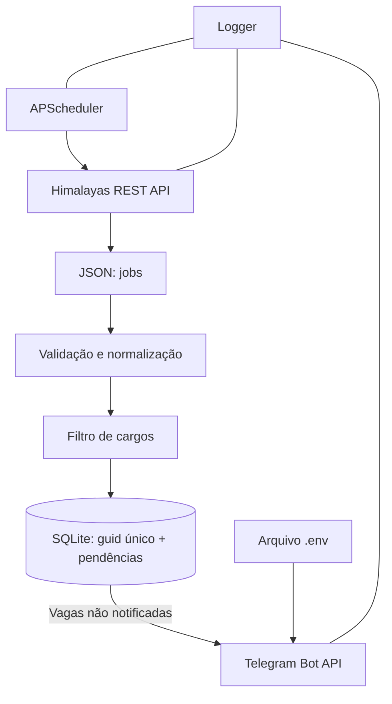

# Arquitetura do Job Monitor

```mermaid
flowchart TD
    A[APScheduler] --> B[Himalayas REST API]
    B --> C[JSON: jobs]
    C --> D[Validação e normalização]
    D --> E[Filtro de cargos]
    E --> F[(SQLite: guid único + pendências)]
    F -->|Vagas não notificadas| G[Telegram Bot API]
    H[Arquivo .env] --> G
    I[Logger] --- A
    I --- B
    I --- G
```
